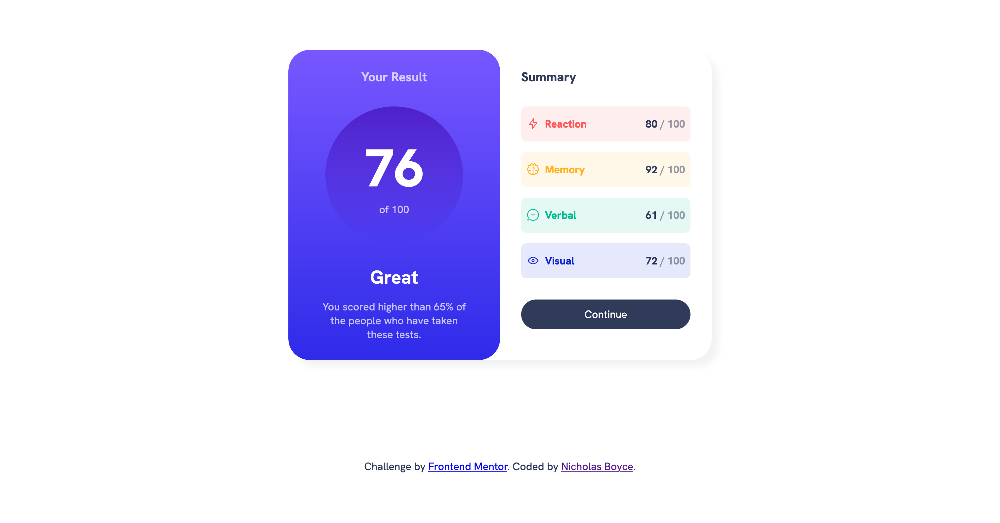

# Frontend Mentor - Results summary component solution

This is a solution to the [Results summary component challenge on Frontend Mentor](https://www.frontendmentor.io/challenges/results-summary-component-CE_K6s0maV). Frontend Mentor challenges help you improve your coding skills by building realistic projects. 

## Table of contents

- [Overview](#overview)
  - [The challenge](#the-challenge)
  - [Screenshot](#screenshot)
  - [Links](#links)
- [My process](#my-process)
  - [Built with](#built-with)
  - [What I learned](#what-i-learned)
  - [Continued development](#continued-development)
  - [Useful resources](#useful-resources)
- [Author](#author)

## Overview

### The challenge

Users should be able to:

- View the optimal layout for the interface depending on their device's screen size
- See hover and focus states for all interactive elements on the page
- **Bonus**: Use the local JSON data to dynamically populate the content

### Screenshot

### Links

- Solution URL: [Github repo here](https://github.com/nicholasboyce/results-summary-component-main)
- Live Site URL: [Github pages here](https://nicholasboyce.github.io/results-summary-component-main/)

## My process

### Built with

- Semantic HTML5 markup
- CSS custom properties
- Flexbox
- CSS Grid

### What I learned

See the Useful Resources section below.

### Continued development

I honestly really got in my own head about this one. But once I recognized that perfection is neither required nor desired, I let myself get some professional guidance from Kevin Powell. He covered this one on Youtube, and his thinking strategies really helped me to feel like I could have a functional process of my own!

### Useful resources

- [Kevin's awesome video](https://youtu.be/KqFAs5d3Yl8?si=tkTKsNquC5IqiNQC) - This helped me to understand how high quality producing front end developers plan out how they will implement design, organize their HTML and CSS, and make it easy for themselves or others to come back and add on to it.

## Author

- Frontend Mentor - [@nicholasboyce](https://www.frontendmentor.io/profile/nicholasboyce)
